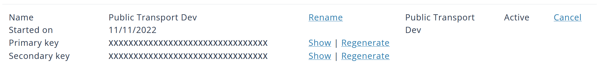

# AKL Live EV Bus

This is the official distribution page for the `AKL Live EV Bus` app. Please take a look at the information below on how to use it.

We support Auckland Transport's [Mission Electric](https://at.govt.nz/about-us/sustainability/mission-electric/).

## Important Message & Disclaimer

- This app is a Java-based Android-only app. Apologies to iOS / iPadOS users as only Mac can do iOS / iPadOS developments but I do not have one with me.
- This app requires Android `8.0` (Oreo) or above to operate.
- This app is **NOT** a replacement for well-structured PT realtime apps like *AT Mobile*, *Google Maps*, *AnyTrip* or *Transit*. As an enthusiastic project, we have very limited resources available compared to these big companies and cannot offer auto-refresh functions in-app.
- All real-time data presented in the app came from [Auckland Transport](https://at.govt.nz/about-us/at-data-sources); All map data came from [OpenStreetMap](https://www.openstreetmap.org/copyright); This repository has zero liability for incorrect data presentation.

## Features

- [x] A list showing all current electric & new energy buses.
- [x] A map visually presenting all electric & new energy buses operating currently.
- [x] A neat Material 3 UI & Dark mode adapted.
- [ ] Detail page showing all about this bus.
- [ ] _Bus search._
- [ ] _Photo library for bus (in terms of model and/or fleet no.)_
- [ ] _Data structure changed from `JSON` to `SQL` (TBA)_
- [ ] _Connection to AnyTrip (TBA depends on availability)_

> We are running into problems with some features due to a lack of information.
>
> A `SQL` hosted via this GitHub repository is quite hard to do for now but we are looking for solutions, meanwhile the core functions (the one already ticked) will remain functional as long as AT have their API unchanged.

## Screenshots

_Will be available once the app becomes more complete..._

## Get started

This instruction will guide you through the preparation work before start using the app itself.

### Download and install

Go to the [Release](https://github.com/Kevincnzuk/live-ev-bus-akl/releases) page and seek the green "Latest" tag, and download the relevant `.apk` file.

Follow the instructions from your device to install it.

### Get an API Key

This step is mandatory as each subscriber has a per-minute and weekly cap.

Each subscriber (primary and secondary key counts together) can run 600 calls/minute up to a maximum of 35000 calls/week. To avoid my key exceeding this limit, it is better if every user uses their dedicated key.

Please also be advised that every refresh of the data set (the main list) **will count as one call**. All other functions, including map, use the data available in the list and thus do not make an extra call.

#### Step by step

1. Go to [Auckland Transport Developer Portal](https://dev-portal.at.govt.nz) and sign in / sign up for an account.
2. Subscribe to the `Public Transport Dev` channel.
3. Go to your `Profile`, under `Subscription` you will see a list like this:

4. Click `Show` and copy the `Primary Key` of the keys to the app's `Setting`, where an input field requires you to enter a `Primary Key`. You may also copy the `Secondary Key` in but it is optional.
5. Click `Save` on the top right, and return to the main page. Swipe down to refresh.

### Ready to use

You are ready to go!

## Troubleshooting

- [Data source currently unavailable.](no_datasets.md)

## Open-source Projects Used

This project would not be possible without these open-source projects.

- [Material Design](https://m3.material.io/) by Google
- [Material Icons](https://github.com/google/material-design-icons) by Google
- [Material Icons Extended](https://github.com/IgniteUI/material-icons-extended) by Infragistics
- [OkHttp](https://github.com/square/okhttp) by Square
- [Picasso](https://github.com/square/picasso) by Square
- [osmdroid](https://github.com/osmdroid/osmdroid) by osmdroid
- [PermissionX](https://github.com/guolindev/PermissionX) by Lin Guo

## License

This project is licensed under the `GNU General Public License v3.0`.

Read more at [`LICENSE`](LICENSE).
